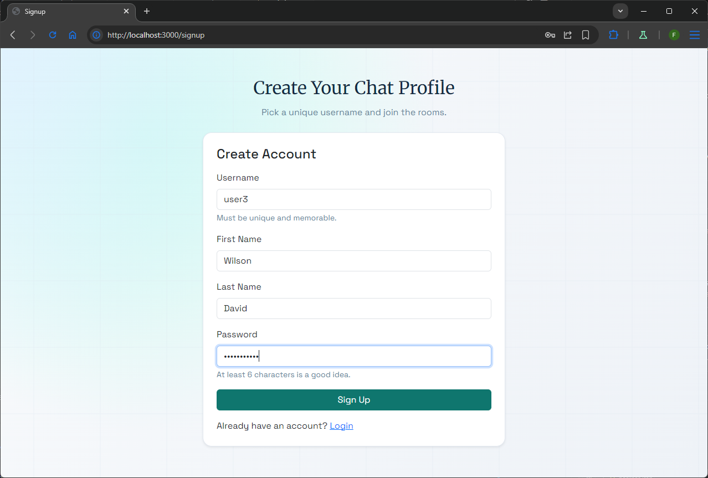
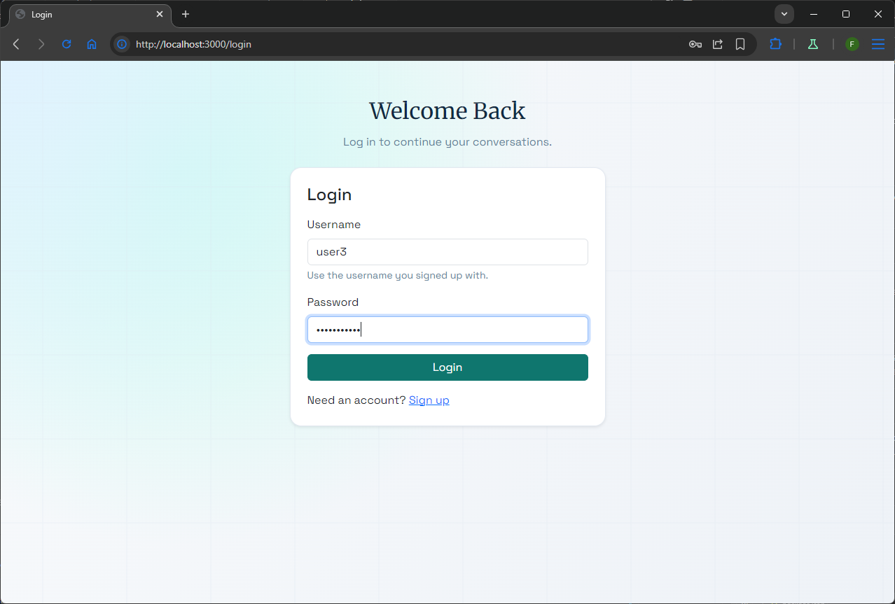
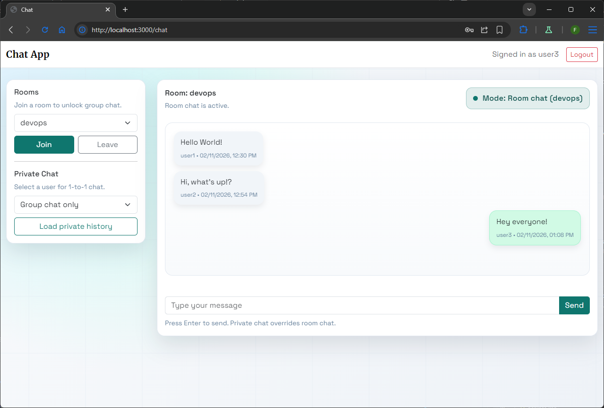
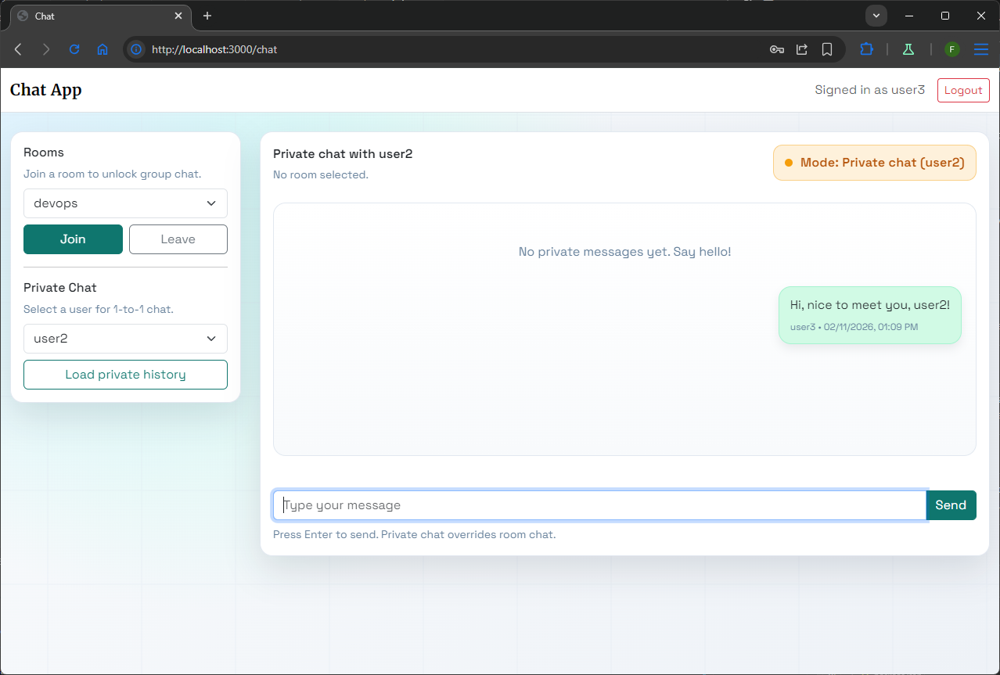
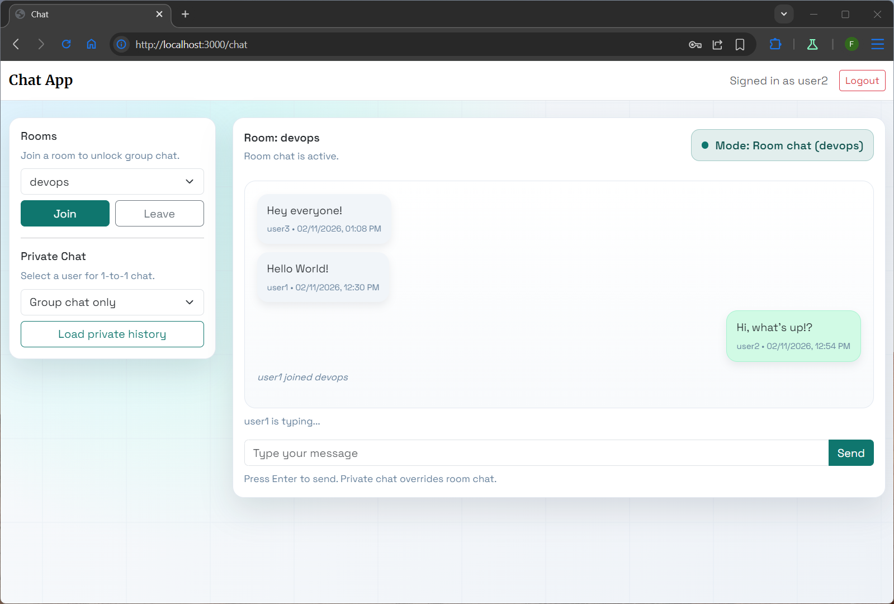

Faraz Safdar - 100775883

# Lab Test 1 Chat App

## Overview
This is a real-time chat application built for COMP3133 Lab Test 1. It supports user signup/login, room-based group chat, private 1-to-1 chat, typing indicators, and message persistence with MongoDB.

## Features
- Signup and login with unique usernames
- LocalStorage session handling
- Join/leave predefined rooms
- Room-based group chat using Socket.io
- Private chat between two users
- Typing indicator for private chat
- Messages saved to MongoDB

## Tech Stack
- Backend: Node.js, Express, Socket.io, Mongoose
- Frontend: HTML5, CSS, Bootstrap, jQuery, fetch
- Database: MongoDB

## How to Run
1) Install dependencies
```
npm install
```

2) Start MongoDB (local)
- Connection string used: mongodb://127.0.0.1:27017/chat_app_lab

3) Start the server
```
npm run dev
```

4) Open the app
- http://localhost:3000

## How It Works
- Sign up with a unique username and password.
- Log in to open the chat UI.
- Join a room for group chat, or select a user for private chat.
- Messages and user data are stored in MongoDB.

## Screenshots

### Signup Page


### Login Page


### Room Chat


### Private Chat


### Typing Indicator


